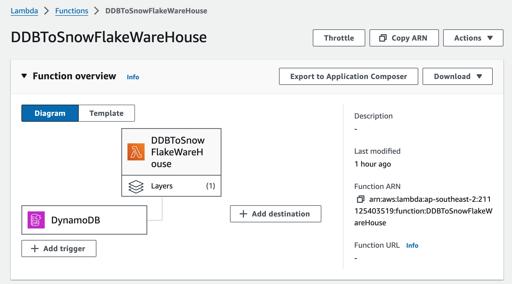
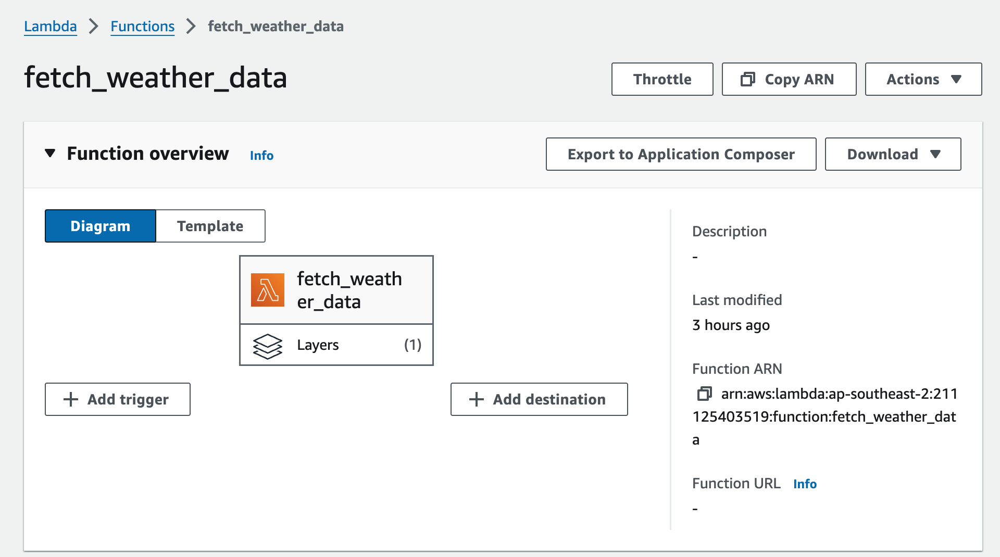
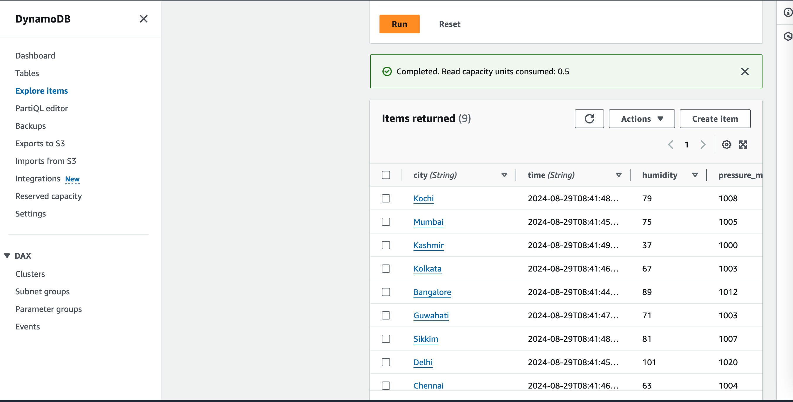
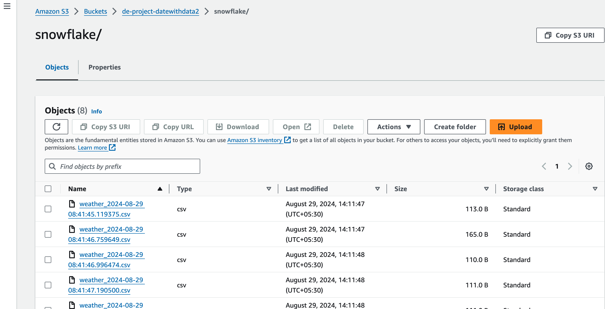
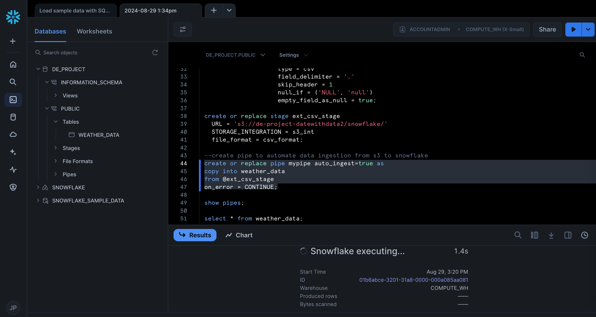

# Weather Data Pipeline with AWS and Snowflake

## Description
This project architecture is designed to automate the process of fetching weather data, processing it, and loading it into a Snowflake database for further analysis. Here's a step-by-step breakdown of the workflow:

1. **AWS Lambda Trigger**: 
   - Every hour, an AWS Lambda function is triggered to fetch the latest weather data from a weather API.

   
   

2. **Data Storage in DynamoDB**: 
   - The fetched data is stored in DynamoDB, a NoSQL database service provided by AWS.
  

3. **DynamoDB Stream to AWS Lambda**: 
   - DynamoDB Streams capture changes in the database and trigger another AWS Lambda function.

4. **Data Processing and Loading to S3**: 
   - The triggered Lambda function processes the data and loads it into an AWS S3 bucket, a scalable storage service.
  

5. **Data Loading into Snowflake**: 
   - Finally, the data stored in S3 is loaded into the Snowflake data warehouse, where it can be queried and analyzed.
  

This automated pipeline ensures that weather data is continuously updated and readily available for analysis in Snowflake.

## Architecture Diagram

1. **Weather API**: An external source where weather data is fetched from.
2. **AWS Lambda (Trigger Every Hour)**: Connected to the Weather API, triggering every hour.
3. **DynamoDB**: Connected to the first Lambda function, showing data being stored.
4. **DynamoDB Stream**: Connected to DynamoDB, triggering the second Lambda function.
5. **AWS Lambda (Data Processing)**: Connected to DynamoDB Stream, processing data.
6. **AWS S3**: Connected to the second Lambda function, where processed data is stored.
7. **Snowflake**: Connected to S3, showing data being loaded into Snowflake.
